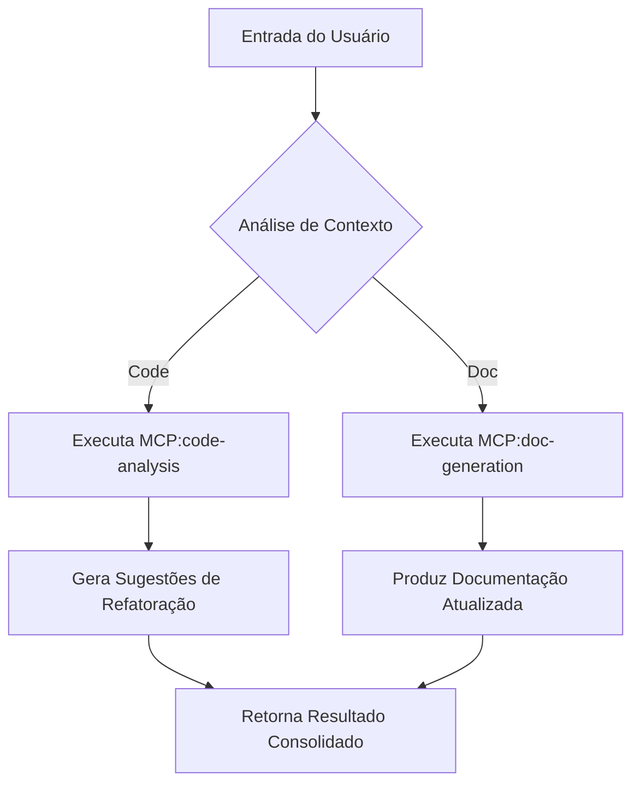

# Análise da Arquitetura dos Templates do Repositório davila7/claude-code-templates  

## 1. Arquitetura Geral do Sistema de Componentes  

O repositório **davila7/claude-code-templates** propõe um modelo modular para a criação de agentes e componentes reutilizáveis dentro do ecossistema Claude Code. A estrutura básica observada nos arquivos raspados é a seguinte:

```
.
├── CLAUDE.md                     # Documentação de alto nível e guia de uso
└── .claude/
    └── agents/
        ├── agent-expert.md       # Template base para agentes especializados
        └── component-improver.md # Template para componentes de melhoria iterativa
```

### 1.1. Agentes  
- **Definição**: Cada agente é um arquivo Markdown localizado em `.claude/agents/`.  
- **Frontmatter YAML**: Contém metadados essenciais (nome, versão, tipo, dependências, escopo).  
- **Corpo**: Dividido em seções padronizadas (Descrição, Expertise, Fluxo de Trabalho, Exemplos, Limitações).  

### 1.2. Comandos e MCPs  
- Embora não estejam presentes nos arquivos analisados, o padrão do repositório prevê a existência de diretórios `.claude/commands/` e `.claude/mcps/` (Model‑Context‑Prompts).  
- **Comandos**: Scripts ou instruções de linha de comando que acionam agentes específicos.  
- **MCPs**: Blocos de prompt reutilizáveis que podem ser importados por agentes para evitar duplicação de contexto.  

### 1.3. Fluxo de Integração  
1. **Descoberta**: O sistema procura por arquivos `.md` dentro de `.claude/agents/` ao iniciar uma sessão.  
2. **Carregamento**: O frontmatter é parseado para validar versão e dependências.  
3. **Instanciação**: O agente é carregado com seu prompt de sistema, pronto para receber entradas do usuário.  
4. **Extensão**: Agentes podem importar MCPs ou chamar outros agentes via referência explícita no corpo do prompt.  

Essa arquitetura favorece **composição** e **isolamento**: cada agente é uma unidade autossuficiente, mas pode ser combinado com outros através de MCPs ou chamadas de comando, promovendo reutilização e manutenção simplificada.  

## 2. Prompts de Sistema Utilizados  

### 2.1. Estrutura do Frontmatter YAML  

Exemplo extraído de `agent-expert.md` (representativo):

```yaml
---
name: Agent Expert
version: "1.2.0"
type: specialist
description: >
  Agente especializado em análise de código, refatoração e geração de documentação técnica.
dependencies:
  - mcp:code-analysis
  - mcp:doc-generation
tags: [code, refactor, documentation]
---
```

- **name**: Identificador legível usado na UI e nos logs.  
- **version**: Semantic versioning para controle de alterações no template.  
- **type**: Classifica o agente (specialist, generalist, orchestrator).  
- **description**: Resumo conciso que aparece em menus de seleção.  
- **dependencies**: Lista de MCPs ou outros agentes necessários para funcionamento pleno.  
- **tags**: Facilita busca e filtragem por domínio ou funcionalidade.  

### 2.2. Seções do Corpo do Markdown  

Após o frontmatter, o corpo segue um padrão de seções que garante consistência e clareza:

#### 2.2.1. Descrição Detalhada  
Expande o campo `description` do frontmatter, abordando motivação, cenários de uso e limitações conhecidas.  

#### 2.2.2. Expertise  
Lista de competências específicas, frequentemente formatada como bullet points ou tabela. Exemplo:

```markdown
- Análise estática de código (AST)
- Sugestões de refatoração baseadas em padrões de design
- Geração de docstrings e READMEs automatizados
- Detecção de code smells e vulnerabilidades leves
```

#### 2.2.3. Fluxo de Trabalho (Workflow)  
Descreve o passo‑a‑passo que o agente segue ao receber uma entrada. Pode incluir diagramas Mermaid ou pseudocódigo:



#### 2.2.4. Exemplos de Uso  
Blocos de código que ilustram chamadas típicas, incluindo variáveis de entrada e saída esperada:

```markdown
**Entrada**
```text
Refatore a função `calculateTax` para usar estratégia de composição.
```

**Saída Esperada**
```text
- Extrair lógica de cálculo para classe `TaxStrategy`.
- Injetar dependência via construtor.
- Atualizar testes unitários correspondentes.
```
```

#### 2.2.5. Limitações e Considerações de Segurança  
Nota explícita sobre o que o agente **não** faz (ex.: não executa código, não modifica arquivos sem confirmação) e quais precauções o usuário deve tomar.  

### 2.3. Vantagens da Estrutura de Prompt  

- **Claridade**: Separar metadados (YAML) do conteúdo instrucional reduz ambiguidade.  
- **Extensibilidade**: Novas seções podem ser adicionadas sem quebrar parsers existentes (ex.: adicionar uma seção `performance-metrics`).  
- **Reutilização**: MCPs podem ser referenciados por múltiplos agentes, evitando duplicação de instruções complexas.  
- **Auditoria**: O versionamento no frontmatter permite rastrear evolução de capacidades ao longo do tempo.  

## 3. Adaptação desses Padrões para o Nexus Arsenal de Agentes  

O **Nexus Arsenal de Agentes** pode se beneficiar diretamente ao adotar a mesma filosofia de modularidade e documentação estruturada. Os pontos de convergência são:

| Elemento do Template | Equivalente Proposto no Nexus Arsenal | Comentário |
|----------------------|---------------------------------------|------------|
| Frontmatter YAML     | Bloco YAML no início de cada agente `.md` | Mantém metadados padronizados (name, version, type, dependencies, tags). |
| Seções de Expertise  | Seção `## Competências`               | Lista de habilidades técnicas e domínios de aplicação. |
| Fluxo de Trabalho    | Seção `## Fluxo de Operação`          | Pode usar Mermaid ou steps numerados para clareza. |
| Exemplos de Uso      | Bloco `## Exemplos` com entrada/saída | Facilita onboarding e testes de regressão. |
| Dependências (MCPs)  | Campo `dependencies:` apontando para arquivos em `.nexus/mcps/` | Permite reutilização de prompts de contexto comuns. |
| Limitações           | Seção `## Limitações e Avisos`        | Essencial para governança e segurança. |

A adoção desse modelo trará **consistência** entre os agentes do arsenal, reduzirá a curva de aprendizado para novos contribuidores e permitirá ferramentas de automação (linters, geradores de documentação, pipelines de CI) que leiam o frontmatter para validar versões e gerar catálogos dinâmicos.  

## 4. Recomendações Específicas para Implementar um Sistema Similar no Nexus Arsenal de Agentes  

1. **Padronizar o Frontmatter**  
   - Criar um schema JSON‑Schema que valide os campos obrigatórios (`name`, `version`, `type`, `description`, `dependencies`).  
   - Incluir um campo opcional `author` e `created-at` para rastreabilidade.  

2. **Estabelecer Diretórios Convenção**  
   - `.nexus/agents/` para templates de agentes.  
   - `.nexus/mcps/` para Model‑Context‑Prompts reutilizáveis (ex.: `code-analysis.mcp`, `security-scan.mcp`).  
   - `.nexus/commands/` para scripts de invocação (shell, node, python).  

3. **Definir Seções Obrigatórias do Corpo**  
   - Utilizar um template Markdown base (`agent-template.md`) que contenha os placeholders:  
     ```markdown
     ## Descrição
     <!-- Descrição detalhada do agente -->

     ## Competências
     <!-- Lista de habilidades -->

     ## Fluxo de Operação
     <!-- Diagrama ou steps -->

     ## Exemplos
     <!-- Blocos de entrada/saída -->

     ## Limitações e Avisos
     <!-- Restrições conhecidas -->
     ```  
   - Exigir que todo novo agente seja uma cópia desse template, preenchendo os placeholders.  

4. **Automatizar Validação e Geração de Catálogo**  
   - Script CI que percorre `.nexus/agents/`, extrai o frontmatter e produz um arquivo `AGENTS_CATALOG.md` com tabela resumida (nome, versão, type, tags).  
   - Integrar um linter (ex.: `markdownlint`) que verifique a presença das seções obrigatórias e a correta formatação do YAML.  

5. **Versionamento e Distribuição**  
   - Adotar versionamento semântico no campo `version`.  
   - Ao publicar uma nova versão, criar uma tag Git (`v1.2.0`) e gerar um release note a partir da seção `Changelog` (pode ser adicionada como seção opcional).  

6. **Documentação de MCPs**  
   - Cada MCP deve seguir um frontmatter simplificado:  
     ```yaml
     ---
     name: code-analysis
     version: "0.9.0"
     type: mcp
     description: Prompt que instrui o agente a realizar análise estática de código usando AST.
     ---
     ```  
   - Incluir exemplos de uso dentro do próprio arquivo MCP para facilitar o reaproveitamento.  

7. **Treinamento e Onboarding**  
   - Criar um guia de contribuição (`CONTRIBUTING.md`) que explique passo a passo como criar um novo agente usando o template, como testar localmente e como submeter um pull request.  
   - Oferecer um script de scaffolding (`nexus-new-agent`) que solicita interativamente os metadados e gera o arquivo agente pronto para edição.  

## 5. Conclusão sobre o Valor desses Templates para Engenharia de Agentes IA  

Os templates do repositório **davila7/claude-code-templates** demonstram que a engenharia de agentes pode ser tratada como qualquer outro componente de software: com versionamento explícito, separação de preocupações (metadados vs. instruções), e reutilização por meio de módulos bem definidos (MCPs). Essa abordagem traz benefícios tangíveis:

- **Redução de esforço duplicado**: ao centralizar instruções comuns em MCPs, evita‑se a reescrita de prompts semelhantes em diversos agentes.  
- **Maior confiabilidade**: o frontmatter versionado permite que equipes rastreiem exatamente qual versão de um agente está em produção, facilitando rollbacks e auditorias de conformidade.  
- **Escalabilidade**: novos agentes podem ser adicionados simplesmente criando um novo arquivo Markdown que referencia MCPs existentes, sem necessidade de modificar a arquitetura central.  
- **Clareza para o usuário humano**: a estrutura padronizada de descrição, expertise, fluxo de trabalho e exemplos reduz a ambiguidade ao selecionar ou configurar um agente para uma tarefa específica.  

Ao transpor esses princípios para o **Nexus Arsenal de Agentes**, a equipe ganhará um framework robusto que suporta a criação, manutenção e evolução de agentes de IA com o mesmo rigor aplicado a bibliotecas de código tradicional. Isso não apenas acelera o desenvolvimento de soluções baseadas em LLM, mas também eleva a qualidade, a segurança e a governança do ecossistema de agentes como um todo.  

---  

*Este relatório tem como objetivo fornecer uma base técnica sólida para a adoção de padrões de template de agentes no Nexus Arsenal, permitindo que engenheiros repliquem e aprimorem esse modelo com confiança.*