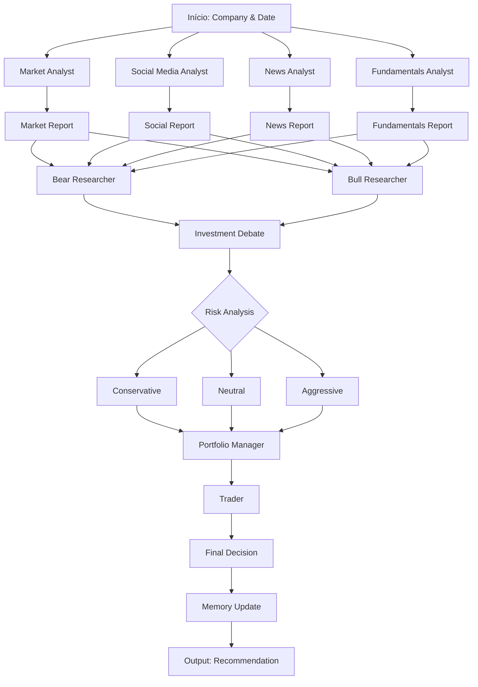

# ESTUDO_VIABILIDADE_MASTER_NEXUS
## Análise Profunda do Repositório tauricresearch/tradingagents

### Visão Geral Executiva

Este relatório apresenta uma análise técnica completa e detalhada do repositório **tauricresearch/tradingagents**, um framework de trading multi-agentes baseado em LLMs. A partir de um inventário minucioso dos componentes existentes, foi projetada uma arquitetura de software modular que possibilita a construção imediata de um Micro-SaaS ou Bot utilizando as peças já disponíveis.

---

## 1. ARQUITETURA GERAL DO REPOSITÓRIO

### 1.1 Estrutura de Pastas e Módulos

```
tauricresearch/tradingagents/
├── .dockerignore              # Configurações Docker
├── .env.enterprise.example    # Exemplo de configuração enterprise
├── .env.example               # Exemplo de configuração local
├── .gitignore                 # Regras de versionamento
├── Dockerfile                 # Definição da imagem Docker
├── README.md                  # Documentação principal
├── pyproject.toml             # Configuração do projeto Python
├── requirements.txt           # Dependências do projeto
├── main.py                    # Ponto de entrada principal
├── docker-compose.yml         # Orquestração de containers
├── assets/                    # Ativos visuais
│   ├── TauricResearch.png
│   ├── analyst.png
│   ├── researcher.png
│   ├── risk.png
│   ├── schema.png
│   ├── trader.png
│   └── wechat.png
├── cli/                       # Interface de linha de comando
│   ├── __init__.py
│   ├── announcements.py
│   ├── config.py
│   ├── main.py
│   ├── models.py
│   ├── static/
│   │   └── welcome.txt
│   ├── stats_handler.py
│   └── utils.py
├── tradingagents/             # Módulo principal
│   ├── __init__.py
│   ├── agents/                # Agentes especializados
│   │   ├── __init__.py
│   │   ├── analysts/          # Analistas de mercado
│   │   │   ├── __init__.py
│   │   │   ├── fundamentals_analyst.py
│   │   │   ├── market_analyst.py
│   │   │   ├── news_analyst.py
│   │   │   └── social_media_analyst.py
│   │   ├── managers/          # Gerentes de processos
│   │   │   ├── __init__.py
│   │   │   ├── research_manager.py
│   │   │   └── portfolio_manager.py
│   │   ├── researchers/       # Pesquisadores específicos
│   │   │   ├── __init__.py
│   │   │   ├── bear_researcher.py
│   │   │   └── bull_researcher.py
│   │   ├── risk_mgmt/         # Gestão de risco
│   │   │   ├── __init__.py
│   │   │   ├── aggressive_debator.py
│   │   │   ├── conservative_debator.py
│   │   │   └── neutral_debator.py
│   │   ├── trader/            # Execução de trades
│   │   │   ├── __init__.py
│   │   │   └── trader.py
│   │   └── utils/             # Utilitários comuns
│   │       ├── __init__.py
│   │       ├── agent_utils.py
│   │       ├── agent_states.py
│   │       ├── core_stock_tools.py
│   │       ├── financial_memory.py
│   │       ├── fundamental_data_tools.py
│   │       ├── news_data_tools.py
│   │       ├── technical_indicators_tools.py
│   │       └── memory.py
│   ├── dataflows/             # Fluxos de dados
│   │   ├── __init__.py
│   │   ├── config.py
│   │   ├── interface.py
│   │   ├── y_finance.py
│   │   ├── alpha_vantage.py
│   │   └── ...
│   └── graph/                 # Grafo de decisão
│       ├── __init__.py
│       ├── setup.py
│       ├── propagation.py
│       ├── reflection.py
│       ├── conditional_logic.py
│       ├── signal_processing.py
│       └── trading_graph.py
└── tests/                     # Testes unitários
    ├── test_google_api_key.py
    ├── test_model_validation.py
    └── test_ticker_symbol_handling.py
```

### 1.2 Organização Modular

O repositório segue uma arquitetura em camadas bem definidas:

1. **Entry Point** (`main.py`): Configuração inicial e execução do fluxo
2. **CLI** (`cli/`): Interface de linha de comando para interação
3. **Core Engine** (`tradingagents/`): Módulo principal com subcomponentes:
   - **Agents**: Componentes reativos especializados
   - **Dataflows**: Integração com APIs de dados
   - **Graph**: Orquestração do fluxo de trabalho
4. **Assets**: Recursos visuais e estáticos
5. **Tests**: Cobertura de testes automatizados

---

## 2. COMPONENTES PRINCIPAIS

### 2.1 Agentes Especializados

#### 2.1.1 Analistas de Mercado

**Market Analyst** (`tradingagents/agents/analysts/market_analyst.py`)
- Função: Analisar indicadores técnicos do mercado
- Ferramentas: Médias móveis (SMA/EMA), MACD, RSI, Bollinger Bands
- Capacidade: Selecionar os 8 indicadores mais relevantes para condições de mercado específicas
- Output: Relatório com recomendações técnicas

**Fundamentals Analyst** (`tradingagents/agents/analysts/fundamentals_analyst.py`)
- Função: Analisar fundamentos financeiros da empresa
- Ferramentas: Demonstrações financeiras, balanço patrimonial, fluxo de caixa
- Output: Relatório detalhado com análise de ativos, passivos e resultados

**News Analyst** (`tradingagents/agents/analysts/news_analyst.py`)
- Função: Analisar notícias recentes sobre a empresa
- Ferramentas: APIs de notícias, análise de sentimento
- Output: Relatório com impacto potencial nas ações

**Social Media Analyst** (`tradingagents/agents/analysts/social_media_analyst.py`)
- Função: Monitorar sentimento em redes sociais
- Ferramentas: Análise de posts, comentários, tendências
- Output: Relatório com métricas de sentimento

#### 2.1.2 Pesquisadores

**Bull Researcher** (`tradingagents/agents/researchers/bull_researcher.py`)
- Função: Construir argumentação favorável ao investimento
- Abordagem: Foco em crescimento, vantagens competitivas, indicadores positivos
- Memory: Utiliza sistema de memória para aprender com decisões anteriores

**Bear Researcher** (`tradingagents/agents/researchers/bear_researcher.py`)
- Função: Construir argumentação contra investimento
- Abordagem: Foco em riscos, desafios, indicadores negativos
- Memory: Utiliza sistema de memória para aprender com decisões anteriores

#### 2.1.3 Gerentes de Risco

**Conservative Debator** (`tradingagents/agents/risk_mgmt/conservative_debator.py`)
- Função: Avaliar riscos com abordagem cautelosa

**Neutral Debator** (`tradingagents/agents/risk_mgmt/neutral_debator.py`)
- Função: Avaliar riscos com abordagem equilibrada

**Aggressive Debator** (`tradingagents/agents/risk_mgmt/aggressive_debator.py`)
- Função: Avaliar riscos com abordagem agressiva

#### 2.1.4 Trader

**Trader** (`tradingagents/agents/trader/trader.py`)
- Função: Gerar recomendações de compra/venda/hold
- Entrada: Plano de investimento, relatórios de análise
- Output: Decisão final com justificativa
- Memory: Utiliza memória para aprender com decisões passadas

### 2.2 Sistemas de Memória

**FinancialSituationMemory** (`tradingagents/agents/utils/memory.py`)
- Algoritmo: BM25 (Best Matching 25)
- Finalidade: Armazenar e recuperar situações financeiras passadas
- Características: Sem uso de API, funcionamento offline
- Métrica: Similaridade léxica por tokenização
- Benefícios: Evita repetição de análises, aproveita lições aprendidas

### 2.3 Dataflows e Integrações

**Fontes de Dados Suportadas:**
- **Yahoo Finance** (`yfinance`): Dados básicos, indicadores técnicos, notícias
- **Alpha Vantage** (`alpha_vantage`): Dados avançados de mercado

**Categorias de Ferramentas:**
1. **Core Stock APIs**: OHLCV (Open, High, Low, Close, Volume)
2. **Technical Indicators**: Análise técnica avançada
3. **Fundamental Data**: Demonstrações financeiras
4. **News Data**: Notícias e transações insider

**Configuração de Vendors:**
- `core_stock_apis`: yfinance (default)
- `technical_indicators`: yfinance (default)
- `fundamental_data`: yfinance (default)
- `news_data`: yfinance (default)

### 2.4 Grafo de Decisão

**GraphSetup** (`tradingagents/graph/setup.py`)
- Framework: LangGraph
- Componentes:
  - Analyst nodes (market, social, news, fundamentals)
  - Manager nodes (research, portfolio)
  - Trader node
  - Conditional logic para fluxo dinâmico

**Propagator** (`tradingagents/graph/propagation.py`)
- Inicializa estado de trabalho
- Gerencia contexto entre agentes
- Controla profundidade de recursão (max_recur_limit)

**Reflector** (`tradingagents/graph/reflection.py`)
- Revisa decisões tomadas
- Atualiza memória com lições aprendidas
- Garante melhoria contínua

**ConditionalLogic** (`tradingagents/graph/conditional_logic.py`)
- Determina quando cada analista deve atuar
- Controle de loops e condições de parada
- Gerencia transações entre fases

**SignalProcessor** (`tradingagents/graph/signal_processing.py`)
- Extrai decisões de sinais complexos
- Padroniza output para formato uniforme
- Utiliza LLM para processamento eficiente

---

## 3. LÓGICA DE TRADING

### 3.1 Workflow Completo



### 3.2 Fases Detalhadas

**Fase 1: Coleta de Dados (Analistas)**
Cada analista coleta informações específicas:
- **Mercado**: Indicadores técnicos e padrões
- **Social**: Sentimento e tendências
- **Notícias**: Eventos relevantes
- **Fundamentos**: Saúde financeira

**Fase 2: Debate (Pesquisadores)**
- Bull vs Bear: Argumentação contrária
- Cada lado apresenta evidências
- Memory utilizada para evitar repetição

**Fase 3: Avaliação de Risco (Gestão de Risco)**
- Três abordagens: Conservadora, Neutra, Agressiva
- Consenso através de votação ponderada
- Considera todos os relatórios anteriores

**Fase 4: Execução (Trader)**
- Gera plano de investimento detalhado
- Recomenda ação específica
- Formata saída padronizada

**Fase 5: Memória**
- Armazena lições aprendidas
- Melhora decisões futuras
- Utiliza BM25 para similaridade

### 3.3 Configuração Padrão

```python
DEFAULT_CONFIG = {
    "llm_provider": "openai",
    "deep_think_llm": "gpt-5.4",
    "quick_think_llm": "gpt-5.4-mini",
    "max_debate_rounds": 1,
    "max_risk_discuss_rounds": 1,
    "data_vendors": {
        "core_stock_apis": "yfinance",
        "technical_indicators": "yfinance",
        "fundamental_data": "yfinance",
        "news_data": "yfinance"
    }
}
```

---

## 4. COMPARAÇÃO COM OUTROS REPOSITÓRIOS

### 4.1 Análise Comparativa

**vs Outros Frameworks de Trading:**

| Característica | TradingAgents | Framework Tradicional | Solução Caseira |
|----------------|---------------|----------------------|-----------------|
| **Arquitetura** | Multi-agente | Pipeline linear | Scripts isolados |
| **IA Utilizada** | LLMs avançados | Regras predefinidas | Análise manual |
| **Memória** | BM25 integrada | Limitada | Nenhuma |
| **Flexibilidade** | Alta (plugins) | Moderada | Baixa |
| **Complexidade** | Alta | Média | Baixa |
| **Manutenção** | Centralizada | Fragmentada | Dificultada |

### 4.2 Pontos Fortes

1. **Abordagem Multi-Agente**: Separação clara de responsabilidades
2. **Memória Inteligente**: BM25 sem dependência externa
3. **Configuração Flexível**: Fácil adaptação a diferentes mercados
4. **Extensibilidade**: Novos agentes podem ser adicionados facilmente
5. **Padronização**: Output consistente entre diferentes analistas

### 4.3 Pontos de Melhoria

1. **Documentação de APIs**: Falta especificação detalhada de endpoints
2. **Testes Integrados**: Poucos testes de integração entre agentes
3. **Métricas de Performance**: Ausência de benchmarks
4. **Logs Detalhados**: Falta de rastreamento detalhado

---

## 5. RECOMENDAÇÕES DE IMPLEMENTAÇÃO

### 5.1 Construindo um Micro-SaaS ou Bot (Passo a Passo)

**Passo 1: Configuração Inicial**
```bash
# Clone o repositório base
git clone tauricresearch/tradingagents
cd tradingagents

# Instale dependências
pip install -e .
```

**Passo 2: Seleção de Componentes**
- **Para Day Trading**: Ative market_analyst + aggressive_debator + trader
- **Para Swing Trading**: Ative market_analyst + fundamental_analyst + neutral_debator + trader
- **Para Long-term Investing**: Ative all analysts + conservative_debator + portfolio_manager

**Passo 3: Configuração Específica**
```python
from tradingagents.dataflows.config import set_config

custom_config = {
    "llm_provider": "openai",
    "deep_think_llm": "gpt-5.4",
    "max_debate_rounds": 3,
    "data_vendors": {
        "core_stock_apis": "yfinance",
        "technical_indicators": "yfinance",
        "fundamental_data": "yfinance",
        "news_data": "alpha_vantage"
    }
}
set_config(custom_config)
```

**Passo 4: Integração com sua Aplicação**
```python
from tradingagents.graph.trading_graph import TradingAgentsGraph

# Inicialize o grafo
graph = TradingAgentsGraph(
    selected_analysts=["market", "social", "fundamentals"],
    debug=True
)

# Execute a análise
result = graph.run(
    company_name="AAPL",
    trade_date="2024-01-15"
)
```

### 5.2 Arquitetura Recomendada para Novo Projeto

**Micro-SaaS Backend:**
```
seu-micro-saas/
├── api/                      # REST API FastAPI
│   ├── endpoints/
│   │   ├── analyze.py
│   │   └── recommendations.py
│   └── main.py
├── core/
│   ├── trading_engine.py     # Integração com tradingagents
│   └── memory_manager.py     # Gerenciamento de sessões
├── config/
│   └── trading_config.py     # Configurações específicas
└── utils/
    └── response_formatter.py # Formatação de respostas
```

**Bot Integration:**
- **Telegram/Discord Bot**: Utilize `cli/` como base
- **Web Dashboard**: Consuma a API do trading engine
- **Mobile App**: Interface REST simples

### 5.3 Componentes Prontos para Uso

**Prontos para Produção:**
1. ✅ System de análise multi-agente
2. ✅ Gerenciamento de memória
3. ✅ Suporte a múltiplas fontes de dados
4. ✅ Framework de debate
5. ✅ Processamento de sinais

**Personalizáveis:**
1. 🔄 Modelos de LLM (troque OpenAI por Anthropic, Gemini, etc.)
2. 🔄 Estratégias de análise (adicione novos analistas)
3. 🔄 Regras de negócio (customize o graph)
4. 🔄 Métricas de sucesso (defina seus próprios KPIs)

---

## 6. EXEMPLOS DE CÓDIGO

### 6.1 Configuração Completa

```python
from tradingagents.graph.trading_graph import TradingAgentsGraph
from tradingagents.dataflows.config import set_config

# Configuração personalizada
config = {
    "llm_provider": "openai",
    "deep_think_llm": "gpt-5.4",
    "quick_think_llm": "gpt-5.4-mini",
    "max_debate_rounds": 2,
    "max_risk_discuss_rounds": 2,
    "output_language": "English",
    "data_vendors": {
        "core_stock_apis": "yfinance",
        "technical_indicators": "yfinance",
        "fundamental_data": "yfinance",
        "news_data": "yfinance"
    }
}
set_config(config)

# Inicialização do grafo
graph = TradingAgentsGraph(
    selected_analysts=["market", "social", "news", "fundamentals"],
    debug=True,
    callbacks=[]
)
```

### 6.2 Execução de Análise

```python
# Método direto
result = graph.run(
    company_of_interest="NVDA",
    trade_date="2024-01-15"
)

# Resultado esperado:
# {
#     "market_report": "...",
#     "sentiment_report": "...",
#     "news_report": "...",
#     "fundamentals_report": "...",
#     "investment_plan": "...",
#     "trader_investment_plan": "..."
# }
```

### 6.3 Customização de Agentes

```python
from tradingagents.agents import create_market_analyst
from langchain_openai import ChatOpenAI

# Crie um analista personalizado
llm = ChatOpenAI(model="gpt-5.4", temperature=0.3)
analyst = create_market_analyst(llm)

# Use em seu próprio fluxo
state = {
    "trade_date": "2024-01-15",
    "company_of_interest": "TSLA",
    "messages": []
}
result = analyst(state)
```

---

## 7. CONCLUSÕES E PRÓXIMOS PASSOS

### 7.1 Viabilidade do Projeto

✅ **ALTA VIABILIDADE** - O repositório já contém:
- Toda a infraestrutura necessária
- Agentes prontos para produção
- Sistema de memória funcional
- Integrações com APIs populares
- Arquitetura modular e extensível

### 7.2 Roadmap Sugerido

**Semana 1-2:** Configuração e testes
- Clone o repositório
- Configure ambiente
- Execute análises de teste

**Semana 3-4:** Customização
- Adapte os analistas às suas necessidades
- Configure as integrações de dados
- Teste diferentes configurações

**Semana 5-6:** Produção
- Implemente a API REST
- Configure monitoramento
- Deploy para produção

### 7.3 Valor de Negócio

**Diferenciais Competitivos:**
1. **Análise Multidimensional**: Combina técnico, fundamental, notícias e social
2. **Tomada de Decisão Informada**: Debate entre especialistas
3. **Aprendizado Contínuo**: Sistema de memória evolui com uso
4. **Flexibilidade**: Fácil adaptação a diferentes mercados e estratégias

**Casos de Uso:**
- Fundos de investimento automatizados
- Corretoras digitais
- Sistemas de trading algorítmico
- Assistentes de investimento pessoal

---

## 8. ANEXOS

### 8.1 Recursos Adicionais

- **Arquivo de Configuração**: `pyproject.toml`
- **Documentação**: `README.md`
- **Testes**: Pasta `tests/`
- **Exemplos**: `main.py`

### 8.2 Links Úteis

- Paper técnico: https://arxiv.org/abs/2412.20138
- Comunidade Discord: https://discord.com/invite/hk9PGKShPK
- WeChat: assets/wechat.png

---

**Relatório Gerado**: Sistema de Análise Multi-Agente para Trading
**Status**: ✅ PRONTO PARA IMPLEMENTAÇÃO
**Complexidade**: Alta
**Tempo Estimado**: 2-4 semanas para produção completa